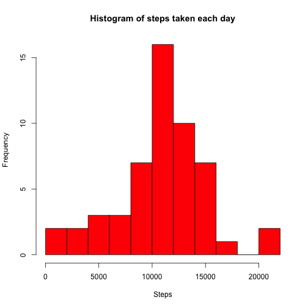
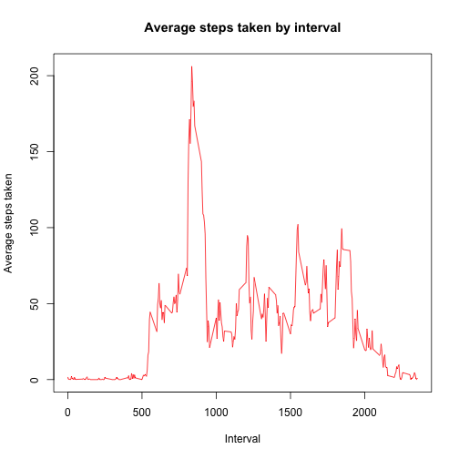
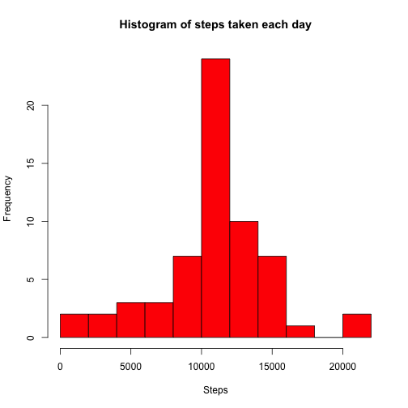

##Loading and preprocessing the data


```r
activity <- read.csv("activity.csv")
str(activity)
```

```
## 'data.frame':	17568 obs. of  3 variables:
##  $ steps   : int  NA NA NA NA NA NA NA NA NA NA ...
##  $ date    : Factor w/ 61 levels "2012-10-01","2012-10-02",..: 1 1 1 1 1 1 1 1 1 1 ...
##  $ interval: int  0 5 10 15 20 25 30 35 40 45 ...
```

We don't want the date to be a factor variable


```r
activity$date <- as.Date(activity$date)
str(activity)
```

```
## 'data.frame':	17568 obs. of  3 variables:
##  $ steps   : int  NA NA NA NA NA NA NA NA NA NA ...
##  $ date    : Date, format: "2012-10-01" "2012-10-01" ...
##  $ interval: int  0 5 10 15 20 25 30 35 40 45 ...
```

```r
summary(activity)
```

```
##      steps             date               interval     
##  Min.   :  0.00   Min.   :2012-10-01   Min.   :   0.0  
##  1st Qu.:  0.00   1st Qu.:2012-10-16   1st Qu.: 588.8  
##  Median :  0.00   Median :2012-10-31   Median :1177.5  
##  Mean   : 37.38   Mean   :2012-10-31   Mean   :1177.5  
##  3rd Qu.: 12.00   3rd Qu.:2012-11-15   3rd Qu.:1766.2  
##  Max.   :806.00   Max.   :2012-11-30   Max.   :2355.0  
##  NA's   :2304
```

###What is mean total number of steps taken?


```r
hist(tapply(activity$steps[!is.na(activity$steps)], activity$date[!is.na(activity$steps)], sum), 10, col="red", xlab = "Steps", main = "Histogram of steps taken each day")
```

 

Lets calculate the mean using the same tapply


```r
mean(tapply(activity$steps[!is.na(activity$steps)], activity$date[!is.na(activity$steps)], sum), na.rm = T)
```

```
## [1] 10766.19
```

Now the median


```r
median(tapply(activity$steps[!is.na(activity$steps)], activity$date[!is.na(activity$steps)], sum), na.rm = T)
```

```
## [1] 10765
```

##What is the average daily activity pattern


```r
dap <- tapply(activity$steps[!is.na(activity$steps)], activity$interval[!is.na(activity$steps)], mean)
plot(as.integer(names(dap)), dap, type = "l", col = "red", main = "Average steps taken by interval", xlab= "Interval", ylab= "Average steps taken")
```

 

Now lets see the 5-minute interval that contains the maximum number of steps


```r
names(dap[which(dap==max(dap))])
```

```
## [1] "835"
```

##Imputing missing values

Lets see how many missing values we have in our dataset (we could also look that it in the summary)


```r
sum(is.na(activity$steps))
```

```
## [1] 2304
```

To fill the missing values, I particularly used the interval mean we calculated previously


```r
activity2 <- data.frame(date = activity$date, interval = activity$interval)
for (i in 1:length(activity$steps)) {
        if (is.na(activity$steps[i])) {
                activity2$steps[i] <- dap[which(activity$interval[i] == as.integer(names(dap)))]
        }
        else {
                activity2$steps[i] <- activity$steps[i]        
        }
}
```

Lets summarize our new dataset with no NA's values


```r
str(activity2)
```

```
## 'data.frame':	17568 obs. of  3 variables:
##  $ date    : Date, format: "2012-10-01" "2012-10-01" ...
##  $ interval: int  0 5 10 15 20 25 30 35 40 45 ...
##  $ steps   : num  1.717 0.3396 0.1321 0.1509 0.0755 ...
```

```r
summary(activity2)
```

```
##       date               interval          steps       
##  Min.   :2012-10-01   Min.   :   0.0   Min.   :  0.00  
##  1st Qu.:2012-10-16   1st Qu.: 588.8   1st Qu.:  0.00  
##  Median :2012-10-31   Median :1177.5   Median :  0.00  
##  Mean   :2012-10-31   Mean   :1177.5   Mean   : 37.38  
##  3rd Qu.:2012-11-15   3rd Qu.:1766.2   3rd Qu.: 27.00  
##  Max.   :2012-11-30   Max.   :2355.0   Max.   :806.00
```

Histogram:


```r
hist(tapply(activity2$steps[!is.na(activity2$steps)], activity2$date[!is.na(activity2$steps)], sum), 10, col="red", xlab = "Steps", main = "Histogram of steps taken each day")
```

 

Mean:


```r
mean(tapply(activity2$steps, activity2$date, sum))
```

```
## [1] 10766.19
```

Median:


```r
median(tapply(activity2$steps, activity2$date[!is.na(activity2$steps)], sum))
```

```
## [1] 10766.19
```

Given the strategy used the stimates remain almost the same (using averages wont affect averages but totals). 

##Are there differences in activity patterns between weekdays and weekends?

Lets create a new factor variable in the dataset with two levels, “weekday” and “weekend”


```r
for (i in 1:length(activity2$date)) {
        if (weekdays(activity2$date[i])%in%c("Saturady","Sunday")) {
                activity2$day[i] <- "weekend"
        }
        else {
                activity2$day[i] <- "weekday"        
        }
}
```

Now we create a panel plot containing a time series plot of the 5-minute interval (x-axis) and the average number of steps taken, averaged across all weekday days or weekend days


```r
wda <- tapply(activity2$steps, list(activity2$interval, activity2$day), mean)
wda2 <- data.frame(steps = append(wda[,1],wda[,2]), interval=as.numeric(c(names(wda[,1]), names(wda[,1]))))
for (i in 1:288){wda2$day[i] <- "weekday"}
for (i in 1:288){wda2$day[288+i] <- "weekend"}
library(lattice)
xyplot(steps ~ interval | day, wda2, main="Time series panel plot of the 5-minute intervals", xlab="Interval",ylab="Average steps", type = "l",layout = c(1,2))
```

 

